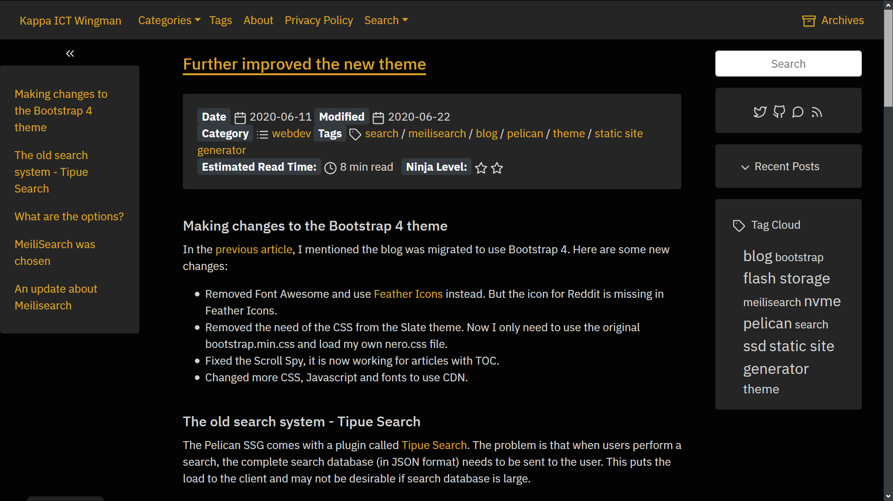

# pelican-kappa-nero

Pelican-kappa-nero is forked from pelican-bootstrap4 and customized. It is a dark theme. This theme is not aimed to be a complete pelican-bootstrap3 rewrite to support Bootstrap 4. You are welcome to clone it or reference it create a generic pelican-bootstrap4 theme.

My previous theme is called pelican-bootstrap3-nero. I created this theme so that I may use Bootstrap 4.

Use it at your own risk.

## Demo site
[My blog: Kappa ICT Wingman](https://www.kappawingman.com)

## Screenshot

## Usage

* Known problems
	* If main content column uses col-xl-auto, the tables or converted code block with line numbers by default are not table responsive
	* DISABLE_SIDEBAR_TITLE_ICONS would not work because of code changes
	* This theme uses Bootstrap 4. But the codes was copied from old theme, which uses Bootstrap 3. So some parts of the theme may not work
	* DISPLAY_BREADCRUMBS is not working. Related code was not migrated to Bootstrap 4
	* Changed from Font Awesome to Feather Icons. Some icons like Reddit are misssing. Some codes that use the old icons are not updated to use the new icons.
	* Limitation: The categories URL (controlled by CATEGORIES_SAVE_AS, a Pelican parameter) could be 'categories.html or /categories/index.html'. One part of the theme relies on CATEGORIES_URL to be categories.html to work (highlight them item in the navigation bar if the current page is categories.html. It is because there is no easy way to know the URL of current page in Pelican.

* Options that must be set in pelicanconf.py:
	* PLUGINS = \['i18n_subsites'\] (required since pelican-bootstrap3)
	* JINJA_ENVIRONMENT = {'extensions': ['jinja2.ext.i18n']}

* No need to set BOOTSTRAP_THEME, bootstrap.min would be used.

* We have new settings specific to this theme, also check CHANGELOG.rst

* Setup Cookie Consent 2
	* COOKIE_CONSENT2 = True
	* Set your message to display in COOKIE_CONSENT2_MESSAGE
	* Set your URL to privacy policy with COOKIE_CONSENT2_PRIVACY_URL
* Setup your account id from IntenseDebate
	* INTENSEDEBATE_ACCOUNT = 'Your account id from IntenseDebate'
* Enable InteseDebate comment system and Google Analytics only if Cookie Consent 2 was consented and accepted
	* GOOGLE_ANALYTICS_UNIVERSAL_CHECK_CONSENT = True
	* Also need to configure parameters according to your setting
	* GOOGLE_ANALYTICS_UNIVERSAL = 'UA-XXXXXX-Y'
	* GOOGLE_ANALYTICS_UNIVERSAL_PROPERTY = 'auto'
* Options for sidebar bottom
	* OPTIONAL_SIDEBAR_BOTTOM = True
	* OPTIONAL_SIDEBAR_BOTTOM_TITLE = 'Disclaimer'
	* OPTIONAL_SIDEBAR_BOTTOM_ID= 'disclaimer'
	* OPTIONAL_SIDEBAR_BOTTOM_TEXT = 'Replace by your text for disclaimer'
* Display at bottom of articles. If you have ad-block software it may not be displayed
	Enable it in pelicanconf.py, TWITTER_CUSTOM = True
* JSON-LD
	* JSON_LD = True
	* Based on existing work from [Flex](https://github.com/alexandrevicenzi/Flex). Thanks to Alexandre
	* Based on existing work from [Emoji-gen](https://github.com/emoji-gen/blog/blob/master/theme/templates/includes/article_structured-data.html). Thanks to Emoj-Gen and Pine.
	* For base / includes/json_ld.html, If enabled, there would be JSON-LD blocks for
	* Type Website and WebPage for all html
	* Type BlogPosting for all articles
	* A limitation of Pelican: currently there is no easy way to get the current URL of the page. So some pages generated for tags and etc could not put the current URL into the JSON-LD. If Pelican provides a Jinja2 variable for this, we would try to update the JSON-LD template.
* JSON-LD, article image and publisher logo are required by Google schema checking
	* SITE_LOGO = 'images/your-image.jpg'
	* PUBLISHER_LOGO = 'images/your-image.jpg'
	* Recommended to set 'CATEGORY_URL' explictly. The include/json_ld.html refers to that variable. If it is not set, it use a default value which may not be same as your system setting
* JSON_LD_BREADCRUMBLIST = True
	* If both JSON_LD is also enabled:
	* Add type BreadcrumbList for all html
	* Note: there is an option DISPLAY_BREADCRUMBS and have visible breadcrumbs and actually added some schema for breadcrumbs. Google search engine would take the value from that. I do not know clearly what is performed by search engine if both Breadcrumb support is enabled in both JSON-LD BREADCRUME and DISPLAY_BREADCRUMS are enabled
* JSON_LD_AUTHOR_SAME_AS = '"https://URL-1", "https://URL-2"'
	* Update it to your links for the sameAs attribute for author. Assume there is only one author for this blog and multiple authors are not supported
* Copy button on the top right corner of all "div.highlight pre" elements
	* SPHINX_COPYBUTTON = True
	* Adopted from [sphinx copybutton](https://github.com/executablebooks/sphinx-copybutton)
	* Credits for the copy button goes to [Chris Holdgraf](https://github.com/choldgraf)
* Added an option OTHER_PAGE_METATAG_DESCRIPTION
	* It is for html file that are not page or article
	* That would a meta tag description to the head section
* Include a KMP search js for tipue
	* TIPUESEARCH_KMP = True
	* Credit goes to [Psychoinformatics.de](https://github.com/psychoinformatics-de/inm7-docs/tree/master/theme/static/tsl)
* Meilisearch
	* MEILISEARCH = True
	* MEILISEARCH_SERVER_URL = 'https://your meilisearch app url'
	* MEILISEARCH_API_KEY = 'KEY', note public key is enough
	* MEILISEARCH_INDEX_UID = 'docs', replace by your index uid
* New option to set meta tag for robots or crawlers
	* Typical setting may be like 'noindex,noimageindex,nosnippet,follow'
	* METATAG_ROBOTS_AUTHOR , for author.html and authors.html
	* METATAG_ROBOTS_TAG , for tag.html and tags.html
	* METATAG_ROBOTS_SEARCH , for meilisearch.html and tipuesearch.html
	* METATAG_ROBOTS_CATGORY , for individual category
	* METATAG_ROBOTS_CATGORIES_PAGE , for categories.html only
	* METATAG_ROBOTS_ARCHIVES_PAGE , for archives.html only

